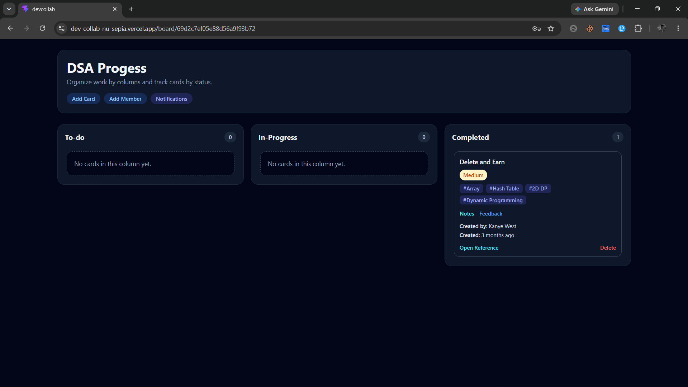
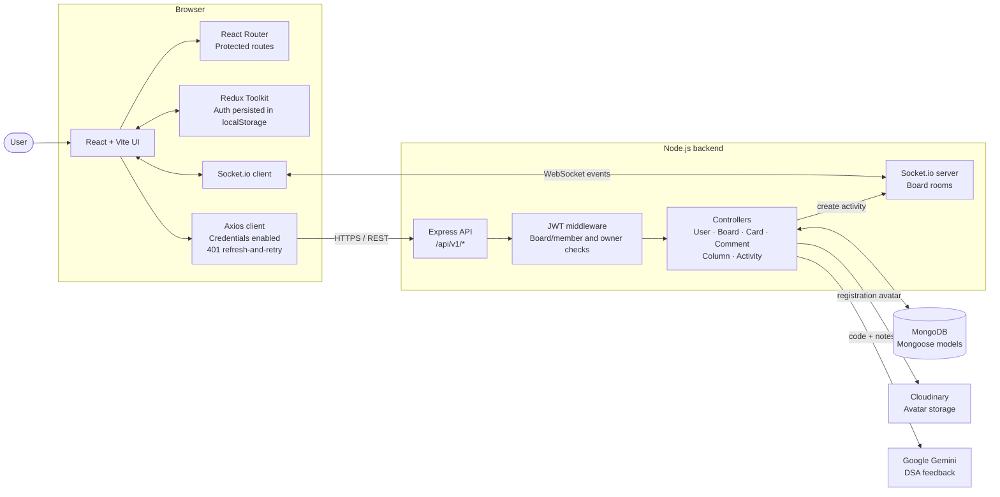
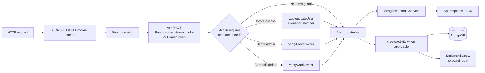
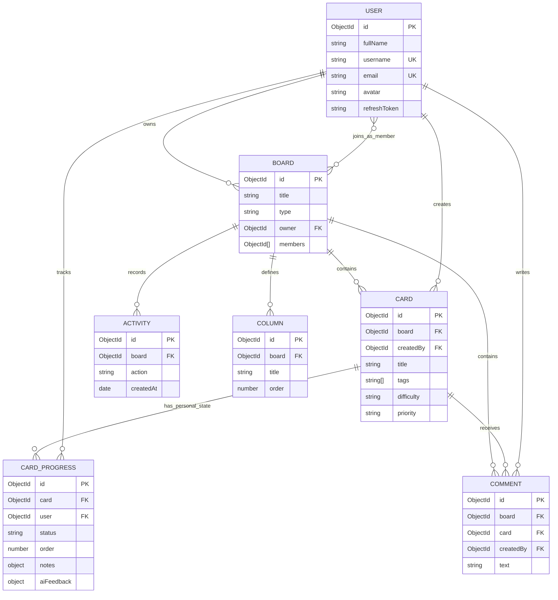
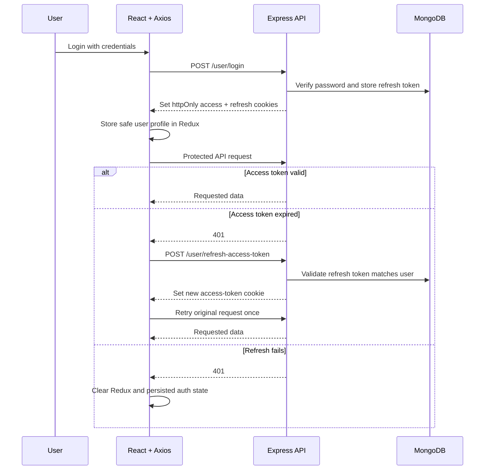
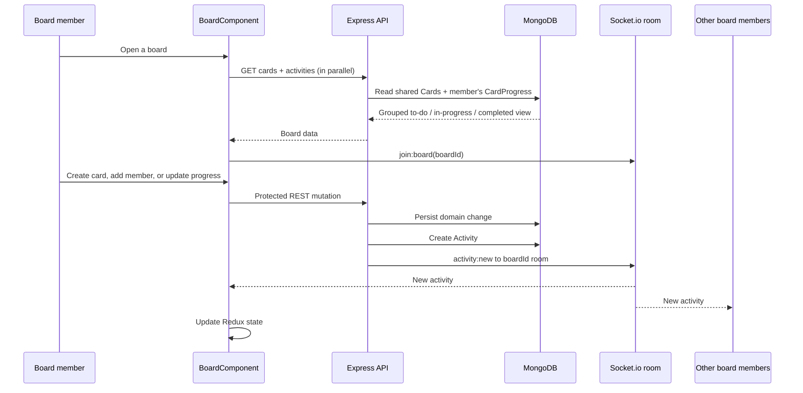
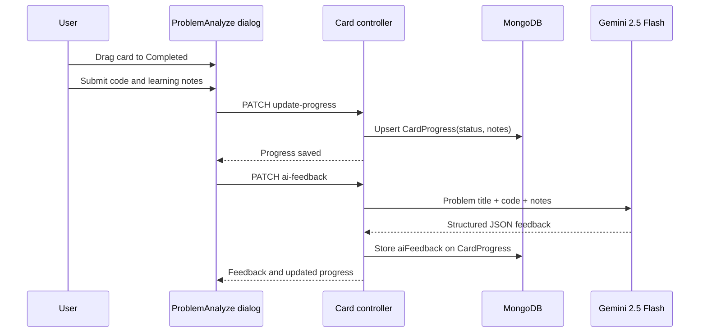

# DevCollab

> Built this because my placement prep group was a mess — 
> WhatsApp messages like "bhai tune sliding window kiya?" 
> with no real answer. DevCollab gives everyone their own 
> progress view on shared DSA boards.

[Live Demo](https://dev-collab-nu-sepia.vercel.app/)

## What it does

You and your study group create a board for a DSA pattern 
(say, Sliding Window). Everyone adds problems as cards. 
Each member tracks their own progress — todo, in-progress, 
done — independently on the same board. When someone 
finishes a problem, everyone sees it move in real time.

Paste your code, write your approach notes, and get 
AI feedback on whether you used the right pattern, 
your actual time/space complexity, and where you can improve.

## The part that took longest to get right

Token refresh on the frontend. When an access token expires 
mid-session, the axios interceptor catches the 401, calls 
the refresh endpoint, retries the original request — all 
without the user noticing. But if the refresh token is also 
expired, it forces logout instead of infinite retry loop. 
Took a while to get that flow right.

## Technical decisions worth mentioning

**Per-user card progress** — cards are shared across the board 
but each member has their own CardProgress document tracking 
their status. One card, five members, five independent states.

**WebSockets for activity feed** — when anyone moves a card 
or adds a comment, the activity appears instantly for everyone 
in that board room. No polling, no refresh.

**AI feedback without storing code** — code is sent to Gemini 
server-side, feedback is stored, code is discarded. 
Only your notes and feedback stay in the DB.

**JWT with refresh rotation** — short-lived access tokens 
(15min) with httpOnly cookie refresh tokens. Middleware chain 
separates auth → board ownership → card ownership concerns.

## Stack

- **Frontend** — React, Redux Toolkit, Socket.io-client, 
  Tailwind CSS, React Router
- **Backend** — Node.js, Express, MongoDB, Socket.io
- **Services** — Cloudinary (avatars), Gemini AI (feedback), 
  JWT (auth)

## Architecture

DevCollab is a collaborative DSA-workspace application. A board and its cards
are shared by a group, while each member owns an independent progress record
for every card. This lets one member mark a problem as complete without
changing another member's board view.

The diagrams below describe the repository as it is currently implemented.
They use Mermaid, which GitHub renders directly in Markdown.

## 1. System overview

## 2. Backend request path

Every protected REST endpoint follows the same layered path. Authorization is
added only where the action needs it: board-member access for shared board
data, board-owner access for administration, and card-creator access for card
management.

## 3. Core data model

`CardProgress` is the key domain design: it separates shared problem metadata
from personal learning state. A single card can therefore appear in different
lanes for different users.

## 4. Authentication and token recovery

The frontend uses cookies for both tokens. The access token is short-lived;
Axios retries one failed protected request after asking the backend for a new
access token. If refresh fails, it clears Redux and its persisted auth state.

## 5. Collaborative board workflow

The board page loads the user's view of each shared card, grouped by personal
status. Activities are both written to MongoDB and broadcast to everyone who
has joined the board's Socket.io room.

## 6. Complete-a-problem and AI feedback workflow

Moving a card to **Completed** opens the problem-analysis dialog. The server
persists reflection notes and Gemini's structured feedback in `CardProgress`.
The submitted solution code is sent to Gemini for evaluation but is not a
field in the database model.

## Current design notes

- The client renders fixed **To-do**, **In-Progress**, and **Completed** lanes from `CardProgress.status`. The `Column` model and endpoints exist server-side but are not used by the current `BoardComponent` display.
- Socket.io is used to update the activity feed in real time. Card and board data itself is updated locally after REST responses, then reloaded when a board is opened.
- Board deletion cascades through boards, cards, comments, columns, and activities. `CardProgress` is a separate collection and is not included in that delete operation in the current controller.

## Summary

> DevCollab is a MERN collaboration platform for DSA study groups. It combines shared boards and cards with per-user `CardProgress` documents, so each group member has an independent learning state. Authentication uses short-lived JWT access cookies with a refresh-and-retry Axios interceptor; board activities are persisted in MongoDB and broadcast through board-scoped Socket.io rooms. When a learner completes a problem, their notes and Gemini feedback are stored as part of their personal progress, while their submitted code is not persisted.

